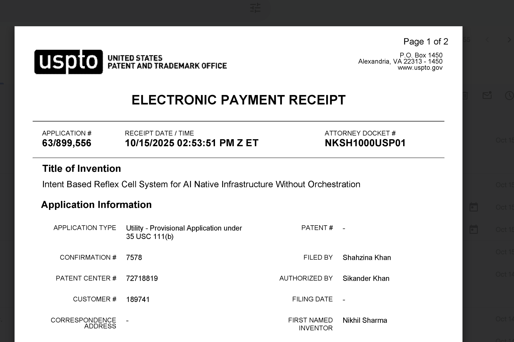

# PATENT_NOTICE.md

This repository contains code, design artifacts, and semantic coordination logic covered under:

**U.S. Provisional Patent Application No. 63/899,556**  
Filed: **October 15, 2025**  
Inventor: **Nikhil Sharma**  
Title: *Intent-Based Reflex Cell Architecture for AI-Native Infrastructure*

The invention introduces Reflex Cells, scoped eBPF maps, Tail‑Call Map optimization, Reflexive GC, NUMA locality, reflex membranes, and semantic coordination primitives. These elements are protected under U.S. patent law.

This notice is provided for informational purposes only and does not grant any license, express or implied, to the patented material.

---

### Technical Scope and Distinctions

- **NUMA Locality**: Reflex Cells optimize memory affinity and CPU socket placement for predictable performance.  
- **GPU Cluster Mesh**: Reflex membranes coordinate GPU binding and interconnect topology across multi‑GPU nodes.  
- **AI Workload Reflex**: Intent‑bound execution replaces orchestration layers for inference and training pipelines.  
- **Reflex Verbs**: Primitives such as reroute, clone, decay, and upgrade dynamically reshape execution in real time.  

---

Celluster™ is a trademark of Nikhil Sharma. All rights reserved.

### USPTO Filing Receipt (Provisional Application)

